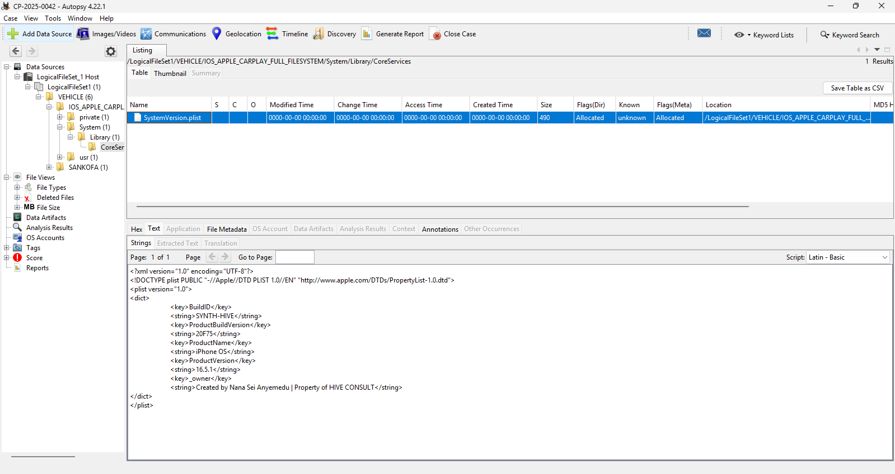
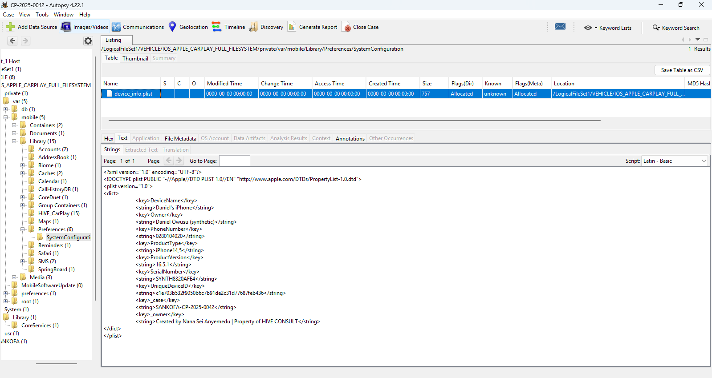

# Case Study 01: Device Identification

## Overview

The first objective of this investigation was to identify the mobile device connected to the Apple CarPlay environment.

Before examining vehicle activity, communications, routes, or user interactions, I needed to establish the identity of the device involved in the investigation. Device attribution is often one of the most important stages of a forensic examination because it provides the foundation for all subsequent analysis.

To accomplish this, I examined system configuration artifacts recovered from the Apple CarPlay Full Filesystem Extraction. These artifacts contained valuable metadata relating to the device, its owner, operating system version, unique identifiers, and other information useful for forensic attribution.

---

# Investigation Objective

The objective of this examination was to answer the following questions:

- What device was connected to the vehicle?
- Who owned the device?
- What operating system was installed?
- What unique identifiers were associated with the device?
- Can the recovered artifacts reliably attribute the device to a specific user?

---

# Evidence Sources

During the examination, I identified two artifacts containing device identification information.

| Artifact | Purpose |
|-----------|----------|
| SystemVersion.plist | Operating system and build information |
| device_info.plist | Device ownership and identification details |

---

# Methodology

To identify the device, I manually examined Apple Property List (plist) files recovered from the Full Filesystem Extraction using Autopsy 4.22.1.

The examination involved:

1. Locating system configuration artifacts.
2. Reviewing operating system metadata.
3. Identifying ownership information.
4. Recovering device-specific identifiers.
5. Correlating findings across multiple artifacts.
6. Documenting all recovered evidence.

---

# Evidence Examination

## SystemVersion.plist Analysis

The first artifact examined was the **SystemVersion.plist** file located within the iOS system directory.

### Artifact Location

```text
/System/Library/CoreServices/SystemVersion.plist
```

### Evidence



### Analysis

This artifact contains information regarding the operating system installed on the device.

During examination, I identified the following values:

| Attribute | Value |
|------------|---------|
| Product Name | iPhone OS |
| Product Version | 16.5.1 |
| Product Build Version | 20F75 |
| Build ID | SYNTH-HIVE |

The artifact confirms that the device was operating on **iOS 16.5.1** at the time the extraction was created.

The presence of a valid operating system version provides important contextual information regarding the device environment and assists with compatibility considerations during forensic analysis.

---

## device_info.plist Analysis

The second artifact examined was **device_info.plist**, which contained significantly more identifying information.

### Artifact Location

```text
/var/mobile/Library/Preferences/SystemConfiguration/device_info.plist
```

### Evidence



### Analysis

This artifact contained multiple identifiers associated with the device and its owner.

The following information was recovered:

| Attribute | Value |
|------------|---------|
| Device Name | Daniel's iPhone |
| Owner | Daniel Owusu (synthetic) |
| Phone Number | 0280104020 |
| Product Type | iPhone14,5 |
| iOS Version | 16.5.1 |
| Serial Number | SYNTH8320AFE4 |
| Unique Device ID | c1e703b532f9050b6c7b91de2c31d77687feb436 |
| Case Reference | SANKOFA-CP-2025-0042 |

---

# Device Attribution

By correlating the information recovered from both artifacts, I was able to establish a forensic profile of the connected device.

### Identified Device

| Attribute | Value |
|------------|---------|
| Device Name | Daniel's iPhone |
| Device Model | iPhone14,5 |
| Operating System | iOS 16.5.1 |
| Serial Number | SYNTH8320AFE4 |
| Owner | Daniel Owusu |
| Phone Number | 0280104020 |

The device naming convention strongly suggests that the device belonged to or was primarily used by an individual identified as **Daniel Owusu**.

The recovered phone number further strengthens the attribution by linking the device to a specific subscriber identity.

Additionally, the serial number and unique device identifier provide reliable forensic identifiers that can be used to distinguish this device from any other Apple device.

---

# Findings

During this examination, I identified the following:

1. The connected device was identified as **Daniel's iPhone**.
2. The device owner was identified as **Daniel Owusu**.
3. The device was running **iOS 16.5.1**.
4. The device model was identified as **iPhone14,5**.
5. The device contained a unique serial number and unique device identifier.
6. The recovered artifacts provided sufficient evidence to attribute the Apple CarPlay environment to a specific mobile device and user.

---

# Conclusion

The examination of **SystemVersion.plist** and **device_info.plist** successfully established the identity of the device connected to the Apple CarPlay environment.

Through analysis of these artifacts, I was able to determine the device name, operating system version, device model, phone number, ownership information, and unique identifiers associated with the device.

These findings provide a reliable foundation for subsequent stages of the investigation, including vehicle profiling, route reconstruction, communication analysis, Siri interaction analysis, and final incident reconstruction.
