# Case Study 03: Apple CarPlay Route Reconstruction

## Overview

Following the examination of vehicle identification and user attribution artifacts, I proceeded to analyze navigation-related evidence recovered from the Apple CarPlay environment.

The objective of this examination was to reconstruct historical travel activity, identify recurring destinations, determine navigation habits, and establish movement patterns associated with the vehicle.

To achieve this, I examined three navigation artifacts recovered from the Apple CarPlay filesystem:

- `carplay_navigation.dat`
- `navigation_history.sqlite`
- `navigation_routes.dat`

When analyzed together, these artifacts provided detailed insight into route activity, destination history, navigation searches, route metrics, and vehicle-associated travel behaviour.

---

# Objective

The objectives of this examination were:

- Reconstruct historical travel routes.
- Identify frequently visited destinations.
- Determine navigation habits.
- Correlate evidence across multiple navigation artifacts.
- Associate navigation activity with specific vehicle sessions.

---

# Evidence Sources

## Artifact 1: carplay_navigation.dat

**Location**

```text
/private/var/mobile/Library/HIVE_CarPlay/carplay_navigation.dat
```

This artifact contained navigation-related records generated through Apple CarPlay and supported navigation applications.

Recovered information included:

- Route history
- GPS coordinates
- Recent destinations
- Destination searches
- Frequently visited locations
- Vehicle navigation activity

### Evidence

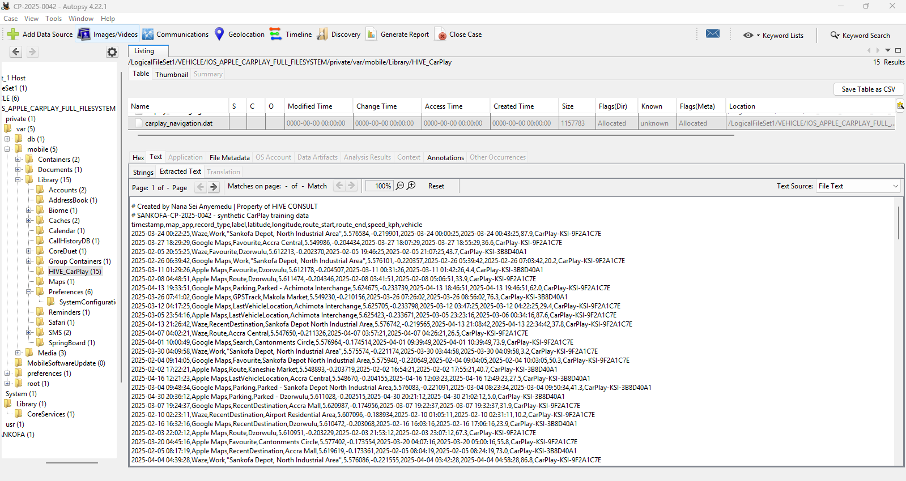

Figure 1: Initial navigation records recovered from the Apple CarPlay navigation artifact.

---

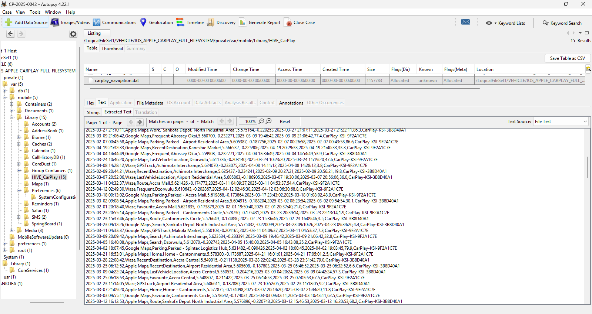

Figure 2: Additional navigation activity showing destination records and route information.

---

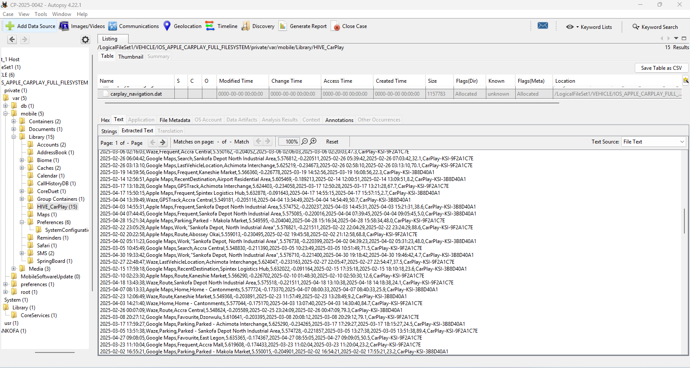

Figure 3: Continued navigation history recovered from the artifact.

---

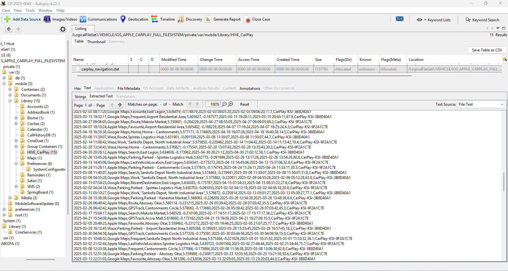

Figure 4: Further route and destination activity recovered from Apple CarPlay.

---

## Artifact 2: navigation_routes.dat

**Location**

```text
/private/var/mobile/Library/HIVE_CarPlay/navigation_routes.dat
```

This artifact contained detailed route reconstruction records including:

- Origin locations
- Destination locations
- Distance travelled
- Route duration
- Average speed
- Navigation application used
- Vehicle session identifiers

### Evidence

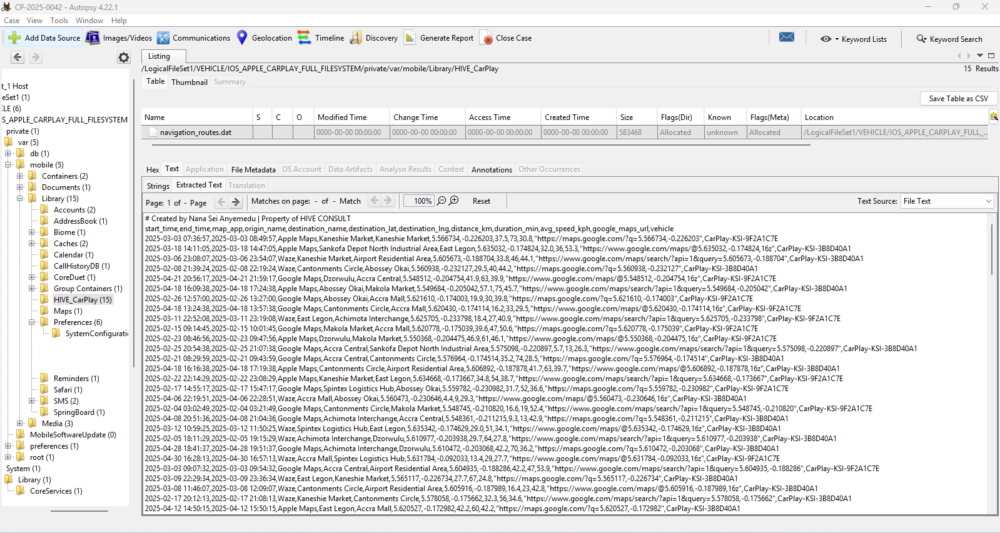

Figure 5: Route dataset showing origin and destination information.

---

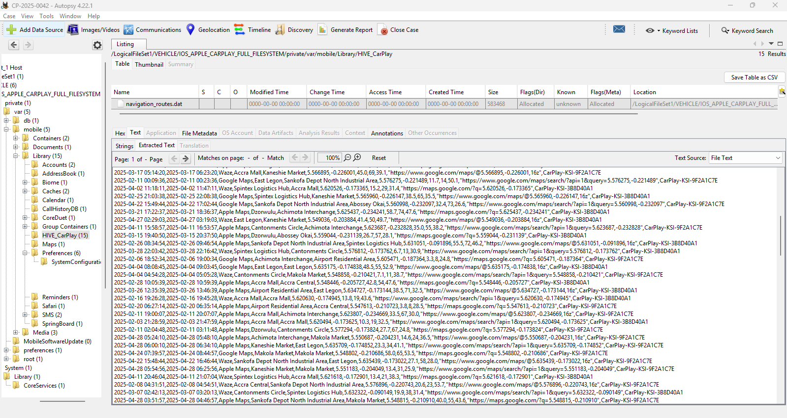

Figure 6: Additional route records recovered from navigation_routes.dat.

---

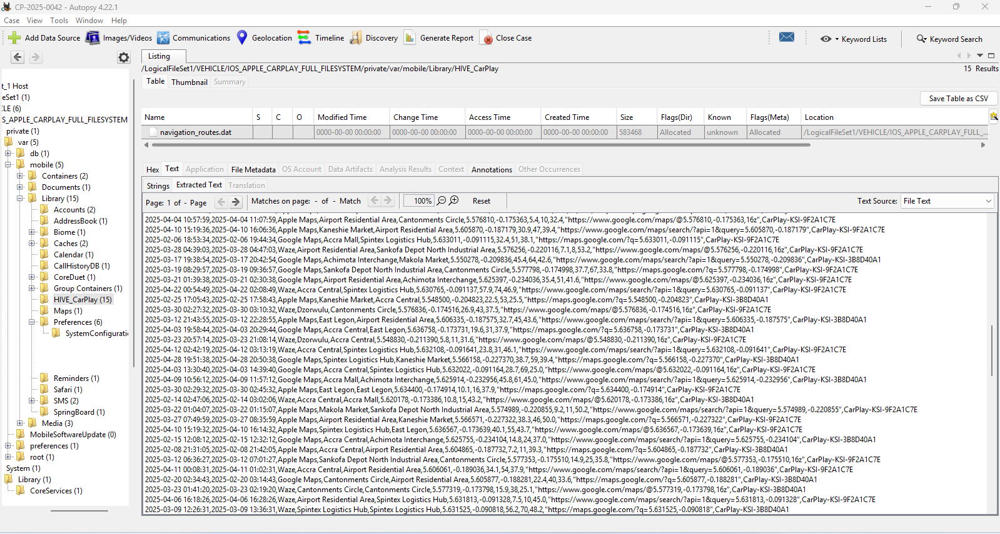

Figure 7: Route history containing distance, duration, and average speed metrics.

---

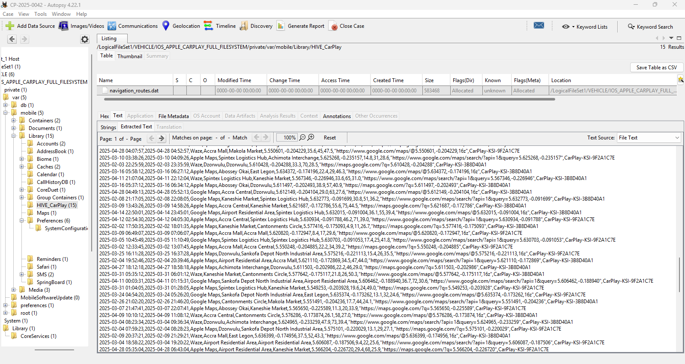

Figure 8: Continued route activity associated with multiple navigation applications.

---

## Artifact 3: navigation_history.sqlite

**Location**

```text
/private/var/mobile/Library/HIVE_CarPlay/navigation_history.sqlite
```

The SQLite database preserved historical navigation activity and destination records generated through Apple CarPlay supported navigation applications.

The database was exported into CSV format for analysis.

### Evidence

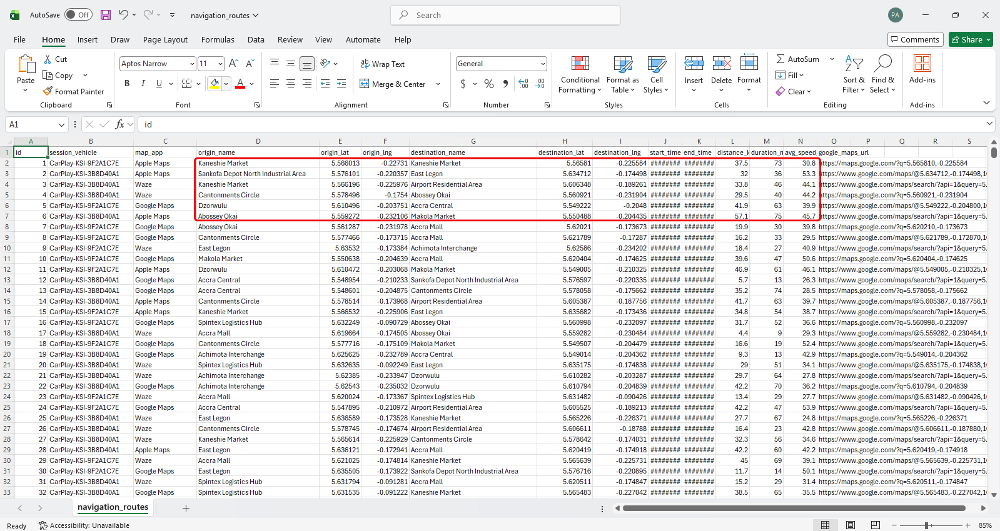

Figure 9: Exported navigation history records.

---

# Route Reconstruction Analysis

Analysis of the recovered artifacts revealed extensive navigation activity throughout the Greater Accra metropolitan area.

The route records documented:

- Origin locations
- Destination locations
- Distance travelled
- Duration of travel
- Average speed
- Navigation application used
- Associated vehicle session identifier

The combined dataset provided sufficient information to reconstruct historical travel activity and identify recurring movement patterns.

---

# Recovered Route Examples


## Route Example 1

| Field | Value |
|---------|---------|
| Vehicle Session | CarPlay-KSI-9F2A1C7E |
| Application | Apple Maps |
| Origin | Kaneshie Market |
| Destination | Kaneshie Market |
| Distance | 37.5 km |
| Duration | 73 minutes |
| Average Speed | 30.8 kph |

---

## Route Example 2

| Field | Value |
|---------|---------|
| Vehicle Session | CarPlay-KSI-3B8D40A1 |
| Application | Apple Maps |
| Origin | Sankofa Depot North Industrial Area |
| Destination | East Legon |
| Distance | 32.0 km |
| Duration | 36 minutes |
| Average Speed | 53.3 kph |

---

## Route Example 3

| Field | Value |
|---------|---------|
| Vehicle Session | CarPlay-KSI-3B8D40A1 |
| Application | Waze |
| Origin | Kaneshie Market |
| Destination | Airport Residential Area |
| Distance | 33.8 km |
| Duration | 46 minutes |
| Average Speed | 44.1 kph |

---

## Route Example 4

| Field | Value |
|---------|---------|
| Vehicle Session | CarPlay-KSI-3B8D40A1 |
| Application | Waze |
| Origin | Cantonments Circle |
| Destination | Abossey Okai |
| Distance | 29.5 km |
| Duration | 40 minutes |
| Average Speed | 44.2 kph |

---

## Route Example 5

| Field | Value |
|---------|---------|
| Vehicle Session | CarPlay-KSI-9F2A1C7E |
| Application | Google Maps |
| Origin | Dzorwulu |
| Destination | Accra Central |
| Distance | 41.9 km |
| Duration | 63 minutes |
| Average Speed | 39.9 kph |

---

# Frequently Visited Locations

Several destinations appeared repeatedly throughout the recovered navigation artifacts.

## Commercial Locations

- Makola Market
- Accra Central
- Accra Mall
- Kaneshie Market
- Abossey Okai

## Residential Areas

- East Legon
- Airport Residential Area
- Cantonments Circle
- Dzorwulu

## Transportation and Logistics Locations

- Sankofa Depot North Industrial Area
- Spintex Logistics Hub
- Achimota Interchange

The repeated occurrence of these destinations suggests routine travel behaviour rather than isolated navigation events.

---

# Navigation Applications Identified

The recovered route records originated from multiple navigation applications.

| Navigation Application |
|------------------------|
| Apple Maps |
| Google Maps |
| Waze |

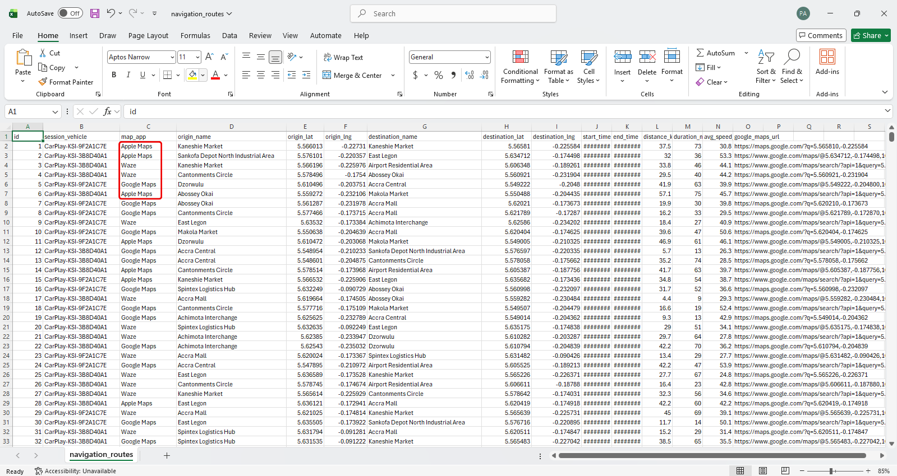

The use of multiple navigation platforms demonstrates that route activity was not restricted to a single mapping service.

---

# Vehicle Session Correlation

Analysis identified two recurring vehicle session identifiers:

```text
CarPlay-KSI-9F2A1C7E
CarPlay-KSI-3B8D40A1
```

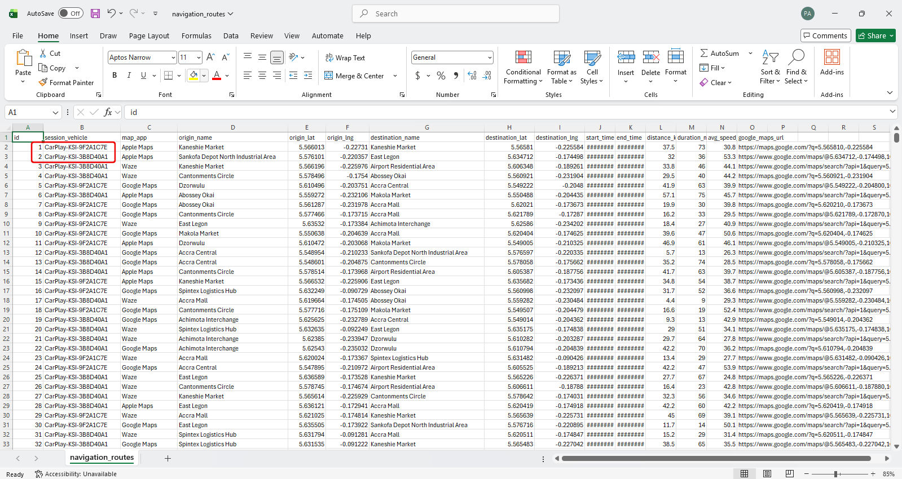


These identifiers appeared repeatedly throughout the route history and provide a direct association between the recovered navigation records and specific CarPlay-enabled vehicle environments.

---

# Correlation Across Artifacts

The findings recovered from:

- `carplay_navigation.dat`
- `navigation_history.sqlite`
- `navigation_routes.dat`

were consistent across all three artifacts.

The artifacts collectively documented:

- Destination searches
- Historical destinations
- Route activity
- Frequently visited locations
- Navigation application usage
- Vehicle-associated navigation records

Cross-validation of these records increases confidence in the reconstructed travel history.

---

# Findings

## Finding 1

Historical route activity was successfully recovered from Apple CarPlay navigation artifacts.

## Finding 2

Navigation activity originated from multiple mapping applications including Apple Maps, Google Maps, and Waze.

## Finding 3

Several locations appeared repeatedly throughout the recovered datasets, including:

- East Legon
- Accra Central
- Accra Mall
- Airport Residential Area
- Makola Market
- Kaneshie Market
- Abossey Okai

## Finding 4

The recovered route records demonstrate recurring movement between commercial centres, residential communities, and logistics-related locations throughout Greater Accra.

## Finding 5

Vehicle session identifiers linked the navigation records to specific CarPlay-enabled vehicle environments.

## Finding 6

Evidence recovered from `carplay_navigation.dat`, `navigation_history.sqlite`, and `navigation_routes.dat` corroborated one another and collectively provided a comprehensive reconstruction of historical navigation activity.

---

# Conclusion

Through examination of three Apple CarPlay navigation artifacts, I successfully reconstructed historical travel activity associated with the vehicle.

The investigation revealed destination history, route activity, navigation application usage, recurring travel patterns, and vehicle-associated session identifiers.

By correlating evidence across all three artifacts, I was able to establish a reliable reconstruction of vehicle movement and navigation behaviour. The recovered records demonstrate the evidential value of Apple CarPlay artifacts during vehicle forensic examinations and provide valuable insight into historical travel activity associated with the examined vehicle.
